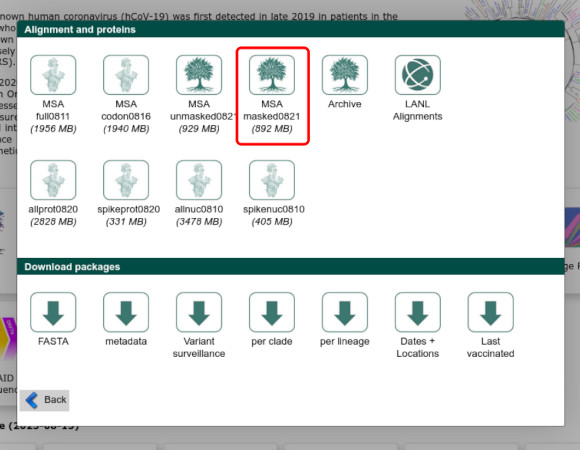
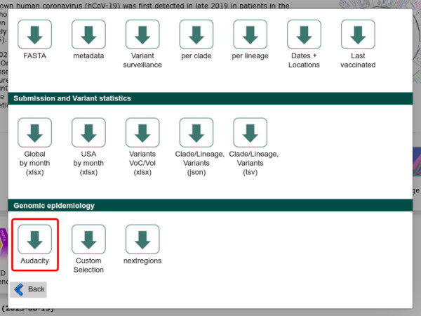

# 2022_sarscov2_epistasis
Estimating epistatic interactions from SARS-CoV-2 genomes, using mutual information

This repository contains the code used to estimate epistatic interactions from multiple
sequence alignments (MSAs) of SARS-CoV-2 genomes, using a mutual information (MI) based method.

The code assumes that the data comes from the GISAID repository, although it will solely focus
on sequences that are also in public repositories.

## Setup

Clone this repository, including submodules

    git clone --recursive git@github.com:microbial-pangenomes-lab/2022_sarscov2_epistasis.git

For convenience all necessary software packages can be installed using the provided conda environment file:

    mamba env create -f environment.yml
    conda activate epistasis

If you have an account on GISAID, head over to the [SARS-CoV-2 page](https://www.epicov.org/epi3/)
and go to the "Downloads" screen. Get the MSA by clicking on the "MSA masked" button.

In the example above this means you will obtain an archive called `mmsa_2023-08-21.tar.xz`, which you should
place in the repository root directory.

From the same "Downloads" screen, scroll down to the "Genomic epidemiology" section and click on the "Audacity"
button. In the next screen click on the "Download tree" button. In the example above you will obtain a file called `GISAID-hCoV-19-phylogeny-2023-08-17.zip`,
which should also be placed in the repository root directory.

## Main analysis

The first step is to subset the MSA to those samples that are present in both the phylogenetic tree
and public repositories. Unfortunately this means that the MSA has to be fully inflated, as there does not seem to be a way to stream a single file from a `.xz` archive.

    bash 01_preprocess.sh GISAID-hCoV-19-phylogeny-2023-08-17.zip mmsa_2023-08-21.tar.xz 16

In the above example we have selected 16 cores to handle inflation/deflation of the MSAs.
As output we have obtained a filtered MSA called `prefiltered.fasta.xz`.

The second step is to split the dataset in two ways: smaller subsets of 1,000, 10,000,
100,000 and 1,000,000 random sequences, and time resolved subsets, one for each month until a
defined cutoff.

    bash 02_split.sh 16 GISAID-hCoV-19-phylogeny-2023-08-17/metadata.csv 2023-03

In the above example we are using 16 cores to deflate the generated MSAs and to run nextclade on
each time-resolved subset. One subset with 2,500 sequences per month will be generated
from February 2020 until March 2023 (`2023-03`). The following directories will be created:

* `data/subsets` with the smaller subsets (i.e. `1000.fasta.xz`, `10000.fasta.xz`, ...)
* `data/time/` with one MSA per month (i.e. `2020-02.fasta.xz`, `2020-03.fasta.xz`, ...)
* `data/time-filtered/` with one MSA per month, after removal of known "bad sequences"
* `out/time-lineages/` with one nextclade output per month (i.e. `2020-02.tsv`, `2020-03.tsv`, ...)

The third step must be repeated multiple times, one for each time resolved subset. It will
concatenate all subsets prior to the focal one in a single file; for instance:

    bash 03_prepare_time_subset.sh 2020-05

Will concatenate the MSA for `2020-02`, `2020-03`, `2020-04`, and `2020-05` into a single one, and
place it in the `data/time-filtered-subsets` directory under the name `2020-05.fasta.xz`.

The fourth step is the actual computation of MI values, and must be repeated for each subset. For
example for the complete dataset the command is:

    bash 04_run.sh GISAID-hCoV-19-phylogeny-2023-08-17.zip 16 prefiltered.fasta.xz out/all-notime

Which will use 16 cores (and more than 200Gb of RAM) and place all outputs in the
`out/all-notime` directory. To speed up this step for the complete dataset we submitted one `src/spydrpick_alt.py` job to a HPC separately. The two important output files are `mi_annotated.tsv.gz` (annotated MI values) and `mi_annotated_prefilter.tsv.gz` (annotated MI values before filtering using the ARACNE algorithm).

For the time resolved subsets an extra argument indicating the final month to consider must be added,
so that the time-weighting can be applied.

    bash 04_run.sh GISAID-hCoV-19-phylogeny-2023-08-17.zip 16 data/time-filtered-subsets/2022-12.fasta.xz out/time-filtered-subsets/2022-12/ 2022-12

The next step is to run [Direct Coupling Analysis using the `plmc` implementation](https://github.com/debbiemarkslab/plmc/). Compile it first:

    cd plmc
    make all-openmp
    cd ..

And then run it on the Spike portion of any MSA of choice:

    bash 05_plmc.sh data/time-filtered-subsets/2023-03.fasta.xz out/spikes/2023-03 16

Which will use 16 cores and create the following files:

* `data/spikes/2023-03.fasta` which contains the nucleotide MSA for the Spike gene
* `out/spikes/2023-03` which contains two files (`2023-03.EC` and `2023-03.params`) as given by `plmc`.

## Reports generation

All the plots shown in the manuscript have been generated through reproducible jupyter notebooks. Once all
analyses have been run, download the necessary support file using the last bash script and then turn on
a jupyter lab instance:

    bash 07_reports.sh
    jupyter lab

You can then run the notebooks one by one to regenerate all plots and supplementary material.

## Citation

    Innocenti, G., & Galardini, M. (2023). Real-time identification of epistatic interactions in SARS-CoV-2 from large genome collections (p. 2023.08.22.554253). bioRxiv. [https://doi.org/10.1101/2023.08.22.554253](https://doi.org/10.1101/2023.08.22.554253)

The method to compute mutual information has been first described in the following publication:

    Pensar, J., Puranen, S., Arnold, B., MacAlasdair, N., Kuronen, J., Tonkin-Hill, G., ... & Corander, J. (2019). Genome-wide epistasis and co-selection study using mutual information. Nucleic acids research, 47(18), e112-e112.

and we made our own implementation following the one described in the [`panaroo` repository](https://github.com/gtonkinhill/panaroo/blob/master/panaroo/spydrpick.py):

    Tonkin-Hill, G., MacAlasdair, N., Ruis, C., Weimann, A., Horesh, G., Lees, J. A., ... & Parkhill, J. (2020). Producing polished prokaryotic pangenomes with the Panaroo pipeline. Genome biology, 21, 1-21.
